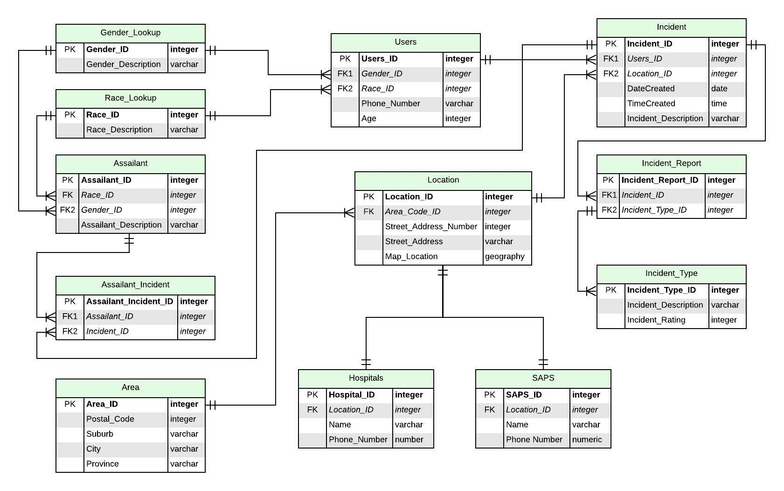

<!-- PROJECT LOGO -->
<br />
<div align="center">
  

<h3 align="center">Safety Checker App</h3>

  <p align="center">
    
  </p>
</div>

<!-- ABOUT THE PROJECT -->
## About The Project
Essentially an app where you can look at a map and click on a pin to see incidents occured at that location.  
The reason for an app like this is to be able to say:

_“I want to visit this address. Will I be safe there?”_

You type the address into a search bar 
* it will pop up saying “No incidents” and you’ll feel better about going. OR
*  it will show up with a “20” like in the above picture, where you can read through incidents, grouped into different types, saying _“catcalled there by man in white car”_ 

```
App Features: 
* Types of incidents, eg. Catcalling, Robbery, Hijacking,
* Incident Decriptions,
* Assailant Decriptions,
* Anonymous users ,
* Multiple locations...
```

### Built With

* [MySQL](https://www.mysql.com/)

### Cloud Instance

* [AWS](https://bbd-internal-sso.awsapps.com/start#)

<!-- ERD UPLOAD -->
### Entity Relational Diagram
<div align="center">
  
  <br>
  <a href="https://lucid.app/lucidchart/3326c5b9-fbfb-4ffe-98ad-022898f7359c/edit?invitationId=inv_c450066e-eef9-4871-a48c-836f6552484b&page=0_0#">
  View ERD on Lucid_Chart</a>
</div>

<!-- GETTING STARTED -->
## Getting Started

If you wish to test out the code and run the DB instance, please follow the instructions below

### Prerequisites

* Cloud Formation Stack Endpoint

  _If you wish to run on a cloud service_
  
  _e.g. [AWS](https://bbd-internal-sso.awsapps.com/start#)_

* Application To Run Endpoint

  _Any front-end application that allows you to connect to the DB on the cloud or to run create a local DB_

  _e.g. [Microsoft SQL Server Management Studio](https://docs.microsoft.com/en-us/sql/ssms/download-sql-servermanagement-studio-ssms?view=sql-server-ver15)_

### Running the scripts

1. Create DB: run the file to create DB and its tables
  ```sh
  SCA_DB_script.sql
  ```
  
2. Run bulk record data script
  ```sh
  bulk_insert_script.sql
  ```
3. Execute the queries 
    
    NB: Run CREATE Statement before the function Execution:
    
    * [SCA_DB_script.sql](https://github.com/AmyPegramBBD/Database_Level_up/blob/main/SCA_DB_script.sql)
    
    _Execute Statement:_ 
    ```sh
    SELECT * FROM Age_vs_Incidents;
    SELECT * FROM Gender_vs_Incidents;
    ```
    
    * [IncidentReport_View.sql](https://github.com/AmyPegramBBD/Database_Level_up/blob/main/IncidentReport_View.sql)
    
    _Execute Statement:_ 
      ```sh
      SELECT * from Incident_Report_View 
      ```
    * [LocationIncident_UDF.sql](https://github.com/AmyPegramBBD/Database_Level_up/blob/main/LocationIncident_UDF.sql)
    
    _Execute Statement:_ 
      ```sh
      SELECT * FROM getIncidentReportFilter_UDF(181, 'Long Street'); 
      ```
    * [usp_Get_Closest_Hospital.sql](https://github.com/AmyPegramBBD/Database_Level_up/blob/main/usp_Get_Closest_Hospital.sql)

    _Execute Statement:_ 
      ```sh
      SELECT 
        [dbo].[vwHospital_Location].[Name], [dbo].[vwHospital_Location].[Phone_Number], 
        [dbo].[vwHospital_Location].[Street_Number], [dbo].[vwHospital_Location].[Street_Name], 
        [dbo].[vwHospital_Location].[Suburb],[dbo].[vwHospital_Location].City,
        dbo.[vwHospital_Location].[Province], Map_Location.ToString() 
      AS 'GPS Location' 
      FROM [dbo].[vwHospital_Location] 
      WHERE Location_ID = 4 
      ```
    * [AreaRatingUDF.sql](https://github.com/AmyPegramBBD/Database_Level_up/blob/main/AreaRating_UDF.sql)

    _Execute Statement:_ 
      ```sh
      --this shows all the suburbs to check area
      SELECT * FROM [Area]

      declare @InputAreaIDForOutputRange INT;
      -- change this value view different areas
      declare @InputAreaID INT;
      set @InputAreaID = 6;   

      select 
      dbo.AreaRatingWithCount(@InputAreaID) [Area Rating],
      dbo.AreaRatingWithRatingRangeOutput(@InputAreaID) [Area Rating Range]
      ```

<!-- MEET THE TEAM -->
## Development Team

- [ ] [Amy Pegram](https://github.com/AmyPegramBBD)
- [ ] [Andrew Bodenstein](https://github.com/AndrewBB-BBD)
- [ ] [Nikita Smal](https://github.com/nikitasmal)
- [ ] [Phumzile Nkosi](https://github.com/PhumzileNkosi)
- [ ] [Riselle Rawthee](https://github.com/RiselleRawthee)
- [ ] [Sandhya I. Singh](https://github.com/ms-si-Singh)

<!-- REFERENCES -->
## References

* [The Hive](https://the-hive.bbd.co.za/)
* [Pluralsight](https://app.pluralsight.com/)
* [MySQL documentation](https://dev.mysql.com/doc/)
